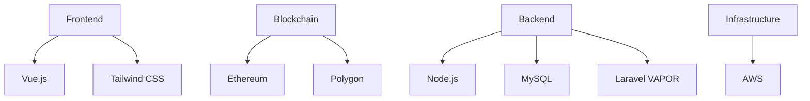

# Dracoscopia & Realmsz Ecosystem

<div align="center">
  
  
  [](https://github.com/dracoscopia/demo-repository/actions/workflows/auto-assign.yml)
  [](https://github.com/dracoscopia/demo-repository/actions/workflows/proof-html.yml)
</div>

Welcome to the unified ecosystem of **Dracoscopia** and **Realmsz** - where digital art meets blockchain innovation. Our platforms work in harmony to provide a complete Web3 experience for creators, collectors, and gaming enthusiasts.

## 🎮 Project Lead

<div align="center">
  
  <h3>Rewainde Scopia</h3>
  <p>Team Lead & Project Director</p>
  <a href="mailto:scopia@realmsz.com">scopia@realmsz.com</a>
</div>

## 🐉 Dracoscopia - NFT Marketplace & Digital Art Platform

<div align="center">
  <a href="https://dracoscopia.com">
    
  </a>
</div>

[Visit Dracoscopia »](https://dracoscopia.com)

Dracoscopia is an innovative NFT marketplace that combines cutting-edge blockchain technology with stunning digital artwork to create unique, verifiable digital assets.

### ✨ Key Features

- **Unique Digital Art Collections**
  <div align="center">
    
  </div>
  - Dragon Series: Legendary dragon NFTs with unique traits
  - Mythical Creatures: Ancient folklore reimagined
  - Cosmic Beings: Celestial entities collection

- **Advanced Trading Features**
  - Real-time auctions with live bidding
  - Secondary market with royalty tracking
  - Cross-chain NFT bridging

- **Creator Tools**
  - Customizable artist profiles
  - Automated royalty distribution
  - Collection analytics dashboard

## 🏰 Realmsz - Gaming Metaverse

<div align="center">
  <a href="https://realmsz.com">
    
  </a>
</div>

[Visit Realmsz »](https://realmsz.com)

Realmsz extends the Dracoscopia ecosystem into an immersive gaming metaverse where NFTs come to life.

### 🎮 Gaming Features

- **Play-to-Earn Mechanics**
  - Daily quests and rewards
  - Tournament systems
  - NFT staking rewards

- **Interactive Worlds**
  - Custom realm building
  - Social spaces
  - Mini-games and events

## 💻 Technology Stack



- **Frontend**: Vue.js 3 with Tailwind CSS
- **Blockchain**: Multi-chain support (ETH, Polygon)
- **Smart Contracts**: Solidity 0.8+
- **Web3 Integration**: ethers.js
- **Backend**: Node.js, Laravel VAPOR & MySQL
- **Cloud Infrastructure**: AWS

## 🚀 Quick Start

1. **Clone the repository**
   ```bash
   git clone https://github.com/dracoscopia/dracoscopia.git
   ```

2. **Install dependencies**
   ```bash
   npm install
   ```

3. **Start development**
   ```bash
   npm run dev
   ```

## 🌐 Ecosystem Links

- **Dracoscopia**
  - [Website](https://dracoscopia.com)
  - [Marketplace](https://dracoscopia.com/marketplace)
  - [Documentation](https://docs.dracoscopia.com)- Coming in realmsz-v0.0.8

- **Realmsz**
  - [Website](https://realmsz.com)
  - [Partnership](https://realmsz.com/partnership) 

## 📧 Contact & Support

- **Direct Contact**: [scopia@realmsz.com](mailto:scopia@realmsz.com)
- **Discord Community**: [Join Our Discord](https://discord.gg/vPyfYzYw)
- **Support Us**: [Patreon](https://patreon.com/dracorisz)
- **Development**: [GitHub](https://github.com/dracoscopia)
- **Work With Us**: [Freelancer](https://www.freelancer.com/u/Dragoljub)

### Quick Links
- **NFT Marketplace**: [Browse NFTs](https://dracoscopia.com/marketplace)
- **Game Portal**: [Play Realmsz v0.0.8](https://play.realmsz.com)- Coming in realmsz-v0.0.8
- **Documentation**: [Developer Docs](https://docs.dracoscopia.com)- Coming in realmsz-v0.0.8

For business inquiries and partnerships, please contact our team lead directly at [scopia@realmsz.com](mailto:scopia@realmsz.com)

## 🤝 Contributing

We welcome contributions! Please read our [Contributing Guidelines](CONTRIBUTING.md) before submitting pull requests.

## 📄 License

This project is licensed under the MIT License - see the [LICENSE](LICENSE) file for details.

We welcome contributions! Please read our [Contributing Guidelines](CONTRIBUTING.md) before submitting pull requests.

## 📄 License

This project is licensed under the MIT License - see the [LICENSE](LICENSE) file for details.
